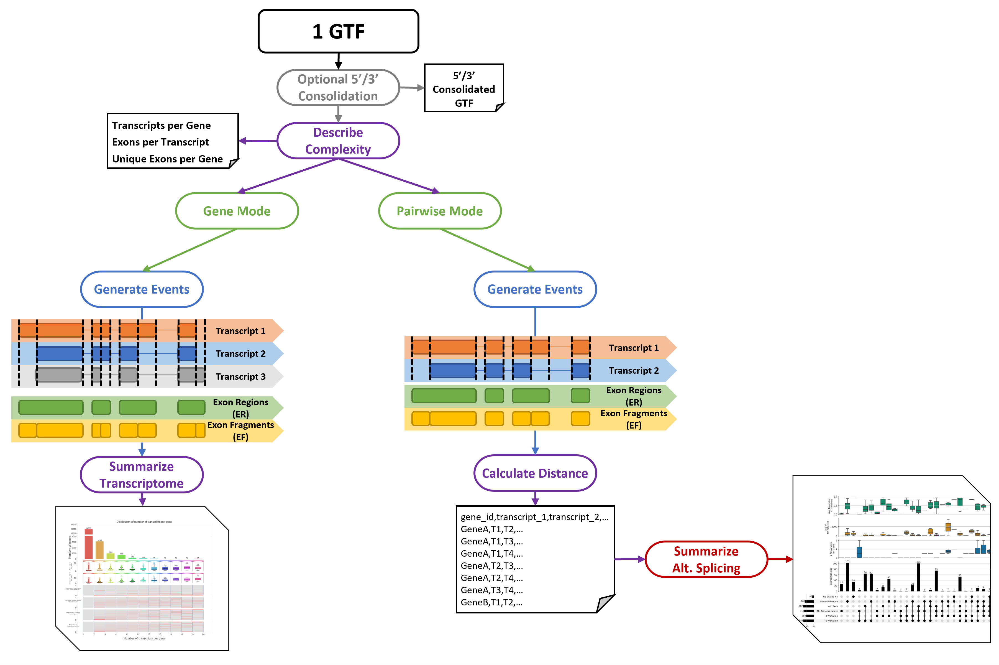
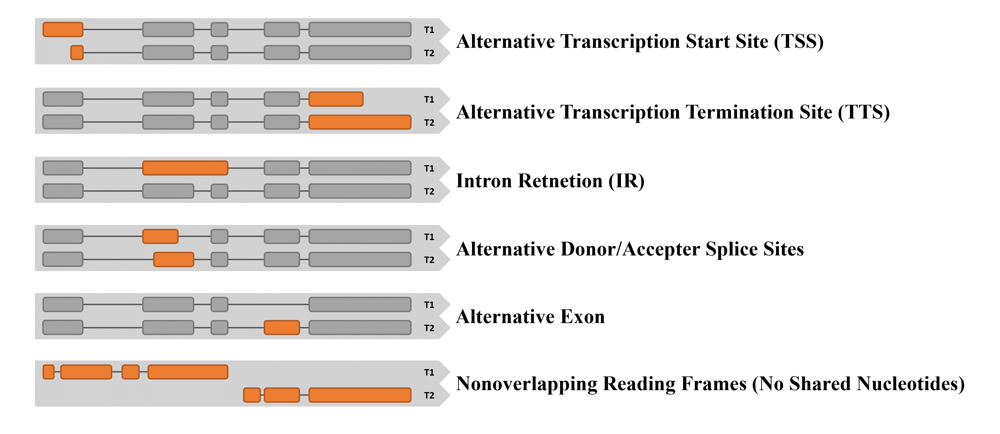

# _TranD_ 1 GTF Input

With a single GTF as input, _TranD_ can be used to calculate and summarize complexity metrics, summarize structural elements of the transcriptome annotation, and summarize transcriptome-wide alternative splicing.

This README gives basic details on the output and function of _TranD_, for more information on how to run it (including a small example), please see the [User Guide](https://github.com/McIntyre-Lab/TranD/wiki/User-Guide).

 

## Splice-Match Consolidation

To focus on the comparison of structural variation in transcript splicing, transcriptome anntoations can be splice-match consolidated (i.e., transcripts with identical splice junctions are consolidated to one uniquely spliced representative transcript that spans the exon space of the contributing transcripts).

**NOTE: This functionality has been converted into the utility id_ujc.py. More information on how to use this utility can be found on the [Utility Description](https://github.com/McIntyre-Lab/TranD/wiki/Utility-Descriptions-(with-Examples)) page.**

 

## Complexity
The following complexity metrics are calculated and summarized (minimum, Q1, median, Q3, maximum, mean, and standard deviation) for the single GTF input:
* Transcripts per gene
* Unique exons (exons with unique coordinates) per gene
* Exons per transcripts

 

## Gene Mode
Running TranD with a single GTF input in __gene__ mode (`-e gene`) produces a figure for summarizing the structural elements of the annotation.

See examples in the [User Guide](https://github.com/McIntyre-Lab/TranD/wiki/User-Guide) and [Precomputed Files](https://github.com/McIntyre-Lab/TranD/wiki/Precomputed-Files).

 

## Pairwise Mode
Running TranD with one GTF input in __pairwise__ mode (`-e pairwise`, default mode) produces a figure for summarizing the combinations of different alternative splicing events (see below) within multi-transcript genes of the given annotation.

 

 

See examples in the [User Guide](https://github.com/McIntyre-Lab/TranD/wiki/User-Guide) and [Precomputed Files](https://github.com/McIntyre-Lab/TranD/wiki/Precomputed-Files).

 

For each gene, the structural elements of each unique pair of transcripts are described and quantified to produce various [pairwise distance metrics](../transcript_distance_column_descriptions.xlsx) that are output to a CSV file.

* These metrics allow for nucleotide-level descriptions of genes within each of the combinations of alternative splicing classifications.
