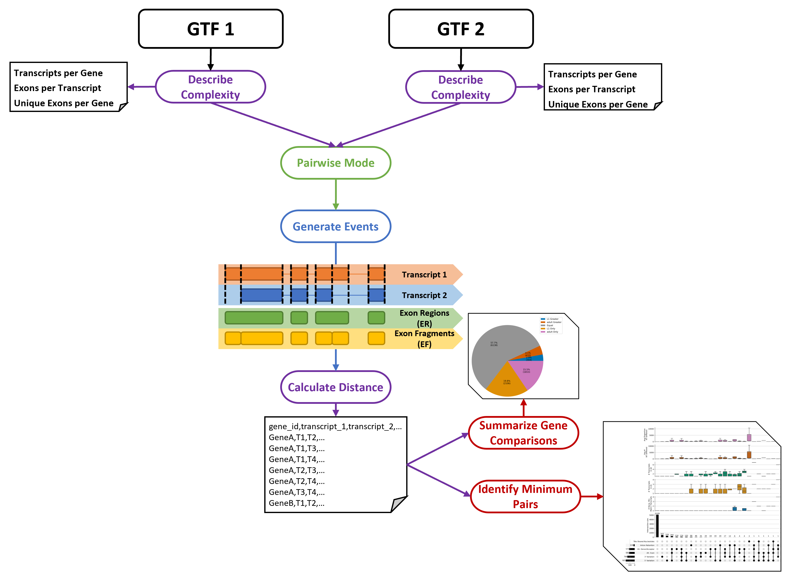
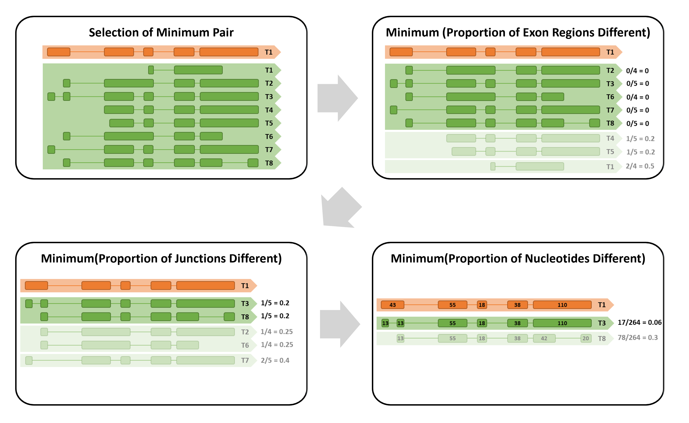
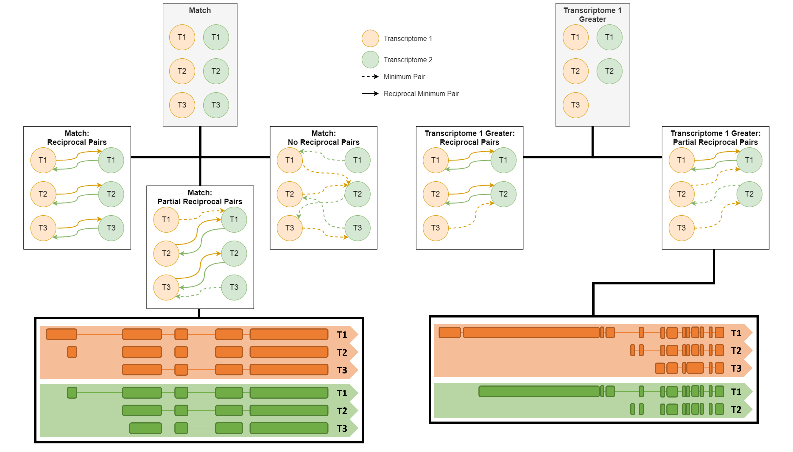

# _TranD_ 2 GTF Input

With two GTF files as input, _TranD_ can be used to calculate and summarize complexity metrics of each GTF file and compare transcript structures across annotations with summarizing visualizations.

This README gives basic details on the output and function of _TranD_, for more information on how to run it (including a small example), please see the [User Guide](https://github.com/McIntyre-Lab/TranD/wiki/User-Guide#comparison-of-two-transcriptomes).

 

## Complexity
The following complexity metrics are calculated and summarized (minimum, Q1, median, Q3, maximum, mean, and standard deviation) for the **each**  GTF input:
* Transcripts per gene
* Unique exons (exons with unique coordinates) per gene
* Exons per transcripts

 

## Pairwise Transcriptome Comparison
Running TranD with two GTF files produces various plots summarizing the gene and transcript level comparisons of the two annotations.

See examples in the [User Guide](https://github.com/McIntyre-Lab/TranD/wiki/User-Guide#comparison-of-two-transcriptomes) and [Precomputed Files](https://github.com/McIntyre-Lab/TranD/wiki/Precomputed-Files#two-gtf-trand).

 

For each gene shared between the two GTF files (require same _gene_id_ value), the structural elements of every unique pair of transcripts across the GTF files are described and quantified to produce various [pairwise distance metrics](../transcript_distance_column_descriptions.xlsx) that are output to a CSV file.
* These metrics allow for nucleotide-level descriptions of genes within each of the combinations of alternative splicing classifications.

 

Additionally, pairs can be evaluated to determine the minimum pair for each transcript (please the information on `-p` in the [User Guide](https://github.com/McIntyre-Lab/TranD/wiki/User-Guide#input-2)). The [minimum distance variables](../minimum_distance_column_descriptions.xlsx) associated with minimum pairs are written to the same CSV output file. Reciprocal minimum pairs, or pairs of transcripts between the GTF files that are identified as the minimums of each other, are labeled and from these categories, gene-level classifications are also assigned.

 

The definition of a "minimum" pair is described below:

 

The definition of a "reciprocal minimum" pair is described below:

 

